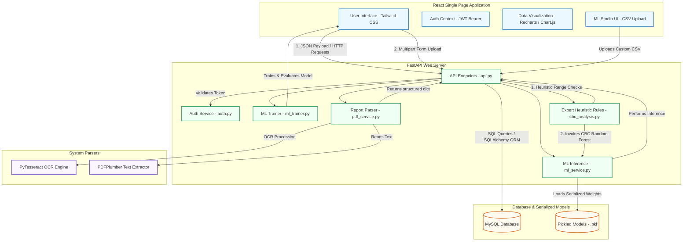

# External Viva & Project Defense Guide: AI Health Analyzer

Welcome to the comprehensive viva preparation guide for **Health-Analyzer**. This document provides a high-level pitch, architectural diagrams, file-by-file explanations, database schema relationships, and a simulated Q&A section to help you ace your project presentation and external viva.

---

## 1. Project Abstract & Pitch (The 1-Minute Intro)
> *"Our project is an **AI-Powered Clinical Decision Support System (CDSS) & Health Analyzer**. It helps users evaluate their health risks for major conditions—specifically **Diabetes, Hypertension, Heart Disease, and Hematological disorders (via Complete Blood Count - CBC)**—using pre-trained clinical machine learning models.*
> 
> *It features a modern **React (Vite + TailwindCSS + Recharts)** frontend, a high-performance **FastAPI (Python)** backend, and a **MySQL** database. Beyond basic predictions, our system integrates **Explainable AI (XAI)** by displaying statistical confidence levels and feature importances to clinical users, incorporates **OCR (using PyTesseract and pdfplumber)** to automatically extract metrics from uploaded PDF or image health reports, and hosts an in-app **ML Studio** for custom dataset upload, training, and testing. It also features a robust **Admin Portal** to track user assessments globally."*

---

## 2. System Architecture

The following diagram illustrates the flow of data through the system, from the user interface down to the machine learning predictions and database persistence:



---

## 3. Technology Stack & Key Libraries

Here is why each component of the stack was chosen:

| Layer | Technology | Primary Role / Purpose |
| :--- | :--- | :--- |
| **Frontend** | **React 19 (Vite)** | A component-based single-page application framework. Vite is used for lightning-fast hot-module replacement and builds. |
| | **TailwindCSS v4** | A utility-first CSS framework used for fully responsive, modern layouts. |
| | **Framer Motion** | Used to create micro-interactions and transitions (e.g., in sidebar toggles and loading states). |
| | **Recharts & Chart.js** | Used on the History & Dashboard views to plot vital trends (Glucose, Blood Pressure, BMI) over time. |
| **Backend** | **FastAPI** | Selected over Flask/Django for its speed (built on Starlette and Uvicorn), asynchronous capability, automatic OpenAPI documentation, and strict type validation using **Pydantic**. |
| | **Uvicorn** | An ASGI (Asynchronous Server Gateway Interface) web server runner for FastAPI. |
| **Database** | **MySQL** | A relational database system chosen to maintain strict relational constraints between users, verification tokens, and their respective reports. |
| | **SQLAlchemy** | The Object-Relational Mapper (ORM) used to model database tables as Python classes. |
| **ML & Data** | **Scikit-Learn** | Used to train the classification models (Logistic Regression for Diabetes, Random Forest for Heart, Hypertension, and CBC). |
| | **Pandas & NumPy** | Used for data manipulation, loading parameters into DataFrames, and structural math. |
| | **Joblib** | Used to serialize (pickle) and deserialize trained ML models to and from files. |
| **OCR / Parsing**| **pdfplumber** | Programmatically extracts text from digital PDF reports. |
| | **PyTesseract & Pillow** | An OCR wrapper for Tesseract-OCR, used to scan scanned image reports (PNG, JPG) and convert pixels to extractable text. |
| **Security** | **Passlib (bcrypt)** | Used to safely hash passwords in the database (one-way hashing). |
| | **python-jose** | Implements JWT (JSON Web Tokens) for authenticating users statelessly. |

---

## 4. Codebase Walkthrough (File-by-File)

### A. Backend Architecture (`backend/src/`)

1. **[api.py](file:///c:/Users/morik/OneDrive/Desktop/Projects/Health-Analyzer/backend/src/api.py)** *(The Main API controller)*
   - Initialized with automatic Swagger UI configuration.
   - Implements robust CORS (Cross-Origin Resource Sharing) middleware to secure browser calls.
   - Declares Pydantic request models (`PatientData`, `UserCreate`, `ForgotPasswordRequest`, etc.) to enforce input types.
   - Contains core endpoints:
     - `/register` & `/token` (JWT Authentication).
     - `/forgot-password` & `/reset-password` (Identity verification and OTP-driven password resets).
     - `/predict` (Diabetes pipeline).
     - `/predict/heart` (Cardio pipeline).
     - `/predict/hypertension` (Hypertension pipeline).
     - `/cbc/analyze` (Hematology pipeline).
     - `/upload-report` (OCR PDF/Image extraction endpoint).
     - `/ml/train-custom` (Accepts CSV, trains Random Forest, returns metrics to ML Studio).
     - `/reports/admin` (Provides aggregated, user-grouped health data for the admin portal).

2. **[ml_service.py](file:///c:/Users/morik/OneDrive/Desktop/Projects/Health-Analyzer/backend/src/ml_service.py)** *(Model Ingestion & Explanations)*
   - Loads `.pkl` model files during application startup.
   - Implements `get_prediction_insights()` to demystify predictions.
   - **Explainable AI (XAI)** logic: Checks if the model has `feature_importances_` (Random Forest) or `coef_` (Logistic Regression), maps the scores to feature names, sorts them, and returns the top 3 contributing factors to the user interface.

3. **[cbc_analysis.py](file:///c:/Users/morik/OneDrive/Desktop/Projects/Health-Analyzer/backend/src/cbc_analysis.py)** *(Hybrid Expert System)*
   - Features standard physiological reference ranges for 13 blood metrics (Hemoglobin, RBC, WBC, Platelets, etc.).
   - Parses unstructured text using regular expressions to find labels and corresponding values (and reference ranges if written in the document).
   - Combines **Heuristics** (e.g., if Hemoglobin is Low $\rightarrow$ flag "Possible Anemia") with **Machine Learning** (predicting diseases like Leukemia or Infection using a multi-class Random Forest model) to form a robust clinical safety net.

4. **[pdf_service.py](file:///c:/Users/morik/OneDrive/Desktop/Projects/Health-Analyzer/backend/src/pdf_service.py)** *(Report Extractor)*
   - Handles multi-format files.
   - Uses `pdfplumber` for text PDFs and `pytesseract` for image scans.
   - Matches raw text against structured regex lists to isolate metric numbers.

5. **[ml_trainer.py](file:///c:/Users/morik/OneDrive/Desktop/Projects/Health-Analyzer/backend/src/ml_trainer.py)** *(Dynamic ML Trainer)*
   - Contains the core implementation of the in-app **ML Studio**.
   - Handles data preprocessing: drops empty columns, uses `LabelEncoder` for categorical inputs, and inputs missing cells with column averages (`SimpleImputer`).
   - Splits data using an 80/20 train-test split, fits a `RandomForestClassifier`, evaluates it (Accuracy, Precision, Recall, F1), calculates feature importances, and extracts 5 random validation samples to return to the React UI.

6. **[database.py](file:///c:/Users/morik/OneDrive/Desktop/Projects/Health-Analyzer/backend/src/database.py)** *(Relational DB Connector)*
   - Configures the SQLAlchemy database engine using credentials.
   - Exposes a raw MySQL connector (`get_db_connection()`) for direct parameter-driven queries.
   - Implements `init_db()` which programmatically runs schema modifications and creates core tables if they do not exist.

7. **[auth.py](file:///c:/Users/morik/OneDrive/Desktop/Projects/Health-Analyzer/backend/src/auth.py)** *(Security module)*
   - Configures OAuth2 authentication protocol.
   - Handles password hashing utilizing **Bcrypt** rounds.
   - Encodes and decodes JWT tokens, packing parameters like user identity (`sub`), user ID (`user_id`), expiration, and system privileges (`role`).

---

## 5. Database Schema & Tables

The project implements a relational schema on MySQL:

```
                  +------------------+
                  |      users       |
                  +------------------+
                  | id (PK)          | <---+
                  | email (Unique)   |     |
                  | mobile_no        |     |
                  | blood_group      |     |
                  | password_hash    |     |
                  | full_name        |     |
                  | role             |     |
                  +------------------+     |
                           |               |
         +-----------------+---------------+-----------------+
         |                 |               |                 |
         v                 v               v                 v
+------------------+ +-----------+ +---------------+ +----------------------+
| patient_reports  | | cbc_reps  | |  heart_reps   | |  hypertension_reps   |
+------------------+ +-----------+ +---------------+ +----------------------+
| id (PK)          | | id (PK)   | | id (PK)       | | id (PK)              |
| user_id (FK) ----| | user_id --| | user_id (FK) -| | user_id (FK) --------|
| glucose          | | cbc_json  | | age           | | age                  |
| blood_pressure   | | interp    | | sex, cp       | | sex, bmi              |
| insulin, bmi     | | prob      | | trestbps      | | heart_rate           |
| diabetes_pred    | | source    | | chol, thalach | | activity_level       |
| risk_level, prob | +-----------+ | prediction    | | smoker, family_hist  |
| source           |               | probability   | | prediction           |
+------------------+               +---------------+ | probability          |
                                                     +----------------------+
```

- **Relationships**: A one-to-many relationship connects the `users` table to the four history tables (`patient_reports`, `cbc_reports`, `heart_reports`, and `hypertension_reports`). When a user is deleted, their reports are detached rather than dropped (`ON DELETE SET NULL`) to retain anonymized medical records for institutional analytics.

---

## 6. Key Viva Q&A (What the Examiner Will Ask)

### Q1: What machine learning models did you use in this project, and why?
**Answer:**
- **Diabetes Prediction:** Logistic Regression. We chose this because diabetes prediction features are continuous biometric ratios, and Logistic Regression fits a linear decision boundary that maps outputs into probabilities (0 to 1) using the sigmoid function. It acts as an efficient baseline model.
- **Heart Disease, Hypertension, and CBC:** Random Forest Classifiers. These are ensemble decision-tree models. We chose them because clinical data is often non-linear, contains multi-class targets (like CBC conditions), and involves categorical features (like smoker, exercise angina). Random Forests resist overfitting, handle missing values well, and provide robust feature importances.

### Q2: What is "Explainable AI (XAI)", and how is it implemented in your project?
**Answer:**
- Examiners dislike "black box" models where a prediction is shown without reason. 
- In our project, we load the features back into the frontend and query the model's coefficients (`coef_` for Logistic Regression) or tree-split weights (`feature_importances_` for Random Forest). 
- We isolate the top 3 contributing biometric markers (e.g., showing a patient that their heart risk is high primarily due to *cholesterol level*, followed by *max heart rate* and *age*). We display this visually on the React frontend, which improves clinical trust.

### Q3: How does your OCR / Document Upload feature work?
**Answer:**
- We implemented a hybrid document ingestion pipeline in `pdf_service.py`.
- If the uploaded file is a text-based PDF, we open it using `pdfplumber` and extract the text programmatically.
- If it is an image (PNG/JPG), we use `PIL (Pillow)` to load the pixels and run **Tesseract-OCR** via `pytesseract` to translate the image pixels into computer-readable text strings.
- Once we have the text, we run compiled regular expressions (regex matching) to find medical variables like `"Glucose"` or `"Hb"` and capture the numeric value next to them to auto-populate the assessment forms.

### Q4: Why did you choose FastAPI instead of Flask?
**Answer:**
- **Speed:** FastAPI is built on Starlette and Uvicorn, making it one of the fastest Python frameworks available, approaching the performance of Node.js and Go.
- **Async Support:** FastAPI natively supports asynchronous requests (`async/await`), which allows it to handle concurrent API calls (like processing a heavy OCR upload while checking database queries) without blocking.
- **Automatic Docs:** It generates interactive swagger documentation (`/docs`) automatically.
- **Data Validation:** It uses Pydantic for automated data serialization and type validation, returning clear validation errors automatically if inputs are out of spec.

### Q5: How is user authentication secured in your project?
**Answer:**
- We do not store plain-text passwords. We use **Passlib** with the **Bcrypt** hashing algorithm to secure passwords with a unique salt.
- For API authorization, we implement state-free authentication using **JWT (JSON Web Tokens)**. When a user logs in, the server returns an encrypted access token containing their identity, user ID, and role.
- For subsequent requests, the React client attaches this token in the HTTP `Authorization` header (`Bearer token`). The server decodes it using a secret key to identify the caller and their access level (user vs admin).

### Q6: Can you explain the ML Studio feature?
**Answer:**
- The ML Studio allows a medical researcher to upload a custom tabular dataset in CSV format. 
- The backend (`ml_trainer.py`) dynamically reads this file, handles missing data using mean imputation, converts categories to integers, splits it into training/validation sets, trains a new Random Forest Classifier, and returns evaluation metrics (Accuracy, F1-score, Precision, Recall, and feature importance scores) directly to the web dashboard. This allows clinicians to test custom hypotheses.

### Q7: What are Accuracy, Precision, Recall, and F1-score?
**Answer:**
- **Accuracy:** The ratio of correct predictions to total predictions.
- **Precision:** Out of all positive predictions, how many were actually correct? (Crucial for reducing false alarms).
- **Recall (Sensitivity):** Out of all actual sick patients, how many did the model find? (Extremely critical in healthcare; we want high recall to avoid missing sick patients).
- **F1-score:** The harmonic mean of Precision and Recall, representing a balanced metric when dealing with imbalanced datasets (e.g., many healthy patients and few sick ones).

---

## 7. How to Run the Project (For Demos)

### A. Run Backend
1. Make sure you have your virtual environment active:
   ```powershell
   cd backend
   .\venv\Scripts\activate
   ```
2. Run the FastAPI server:
   ```powershell
   uvicorn src.api:app --reload
   ```
   *The server will start at `http://127.0.0.1:8000`. You can access swagger docs at `http://127.0.0.1:8000/docs`.*

### B. Run Frontend
1. Open a new terminal:
   ```bash
   cd frontend
   npm run dev
   ```
   *The app will launch at `http://localhost:5173`.*

### C. Default Credentials
- **Admin Panel Access:**
  - Email: `admin@gmail.com`
  - Password: `Admin@123`
- *Registered users can be created directly using the **Sign Up** tab.*
